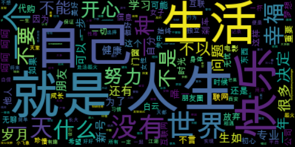
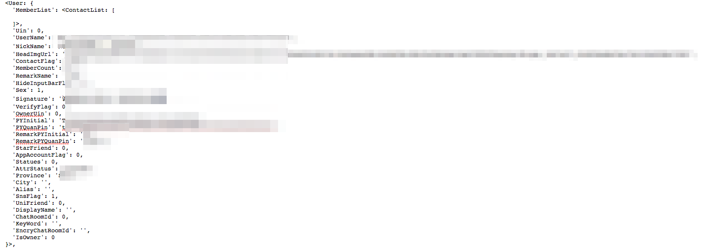

# WeixinData
Use Python to deal Weixin Data

- Python: `3.6.1`
- Module

  | Name   |      Summary      |  WebSite |
  |----------|:-------------|:------|
  |itchat| 微信个人号接口、微信机器人及命令行微信|[https://github.com/littlecodersh/ItChat](https://github.com/littlecodersh/ItChat)|
  |jieba| 中文分词|[https://github.com/fxsjy/jieba](https://github.com/fxsjy/jieba)|
  |wordcloud| Python 的词云生成工具|[https://github.com/amueller/word_cloud](https://github.com/amueller/word_cloud)|
  |os| 获取操作系统的权限|[https://docs.python.org/3.6/library/os.html](https://docs.python.org/3.6/library/os.html)|


## 第三步，获取微信中所有好友的`签名`，将`签名`的内容进行词云分析

- 获取好友中的`签名`信息

```
signature = i["Signature"].replace(" ", "").replace("span", "").replace("class", "").replace("emoji", "")
```

- 使用`jieba`分词

```
wordlist_jieba = jieba.cut(text, cut_all=True)
wl_space_split = " ".join(wordlist_jieba)
```

- 使用`wordcloud`词云进行词云处理

```
my_wordcloud = WordCloud(font_path='/Users/yjshi/Library/Fonts/arialuni.ttf').generate(wl_space_split)
plt.imshow(my_wordcloud, interpolation='bilinear')
plt.axis("off")
plt.show()
```

如果有中主语言需要使用词云时，需要修改`wordcloud`的默认字体。默认字体是不支持**中文字符**的.

```
font_path='/Users/yjshi/Library/Fonts/arialuni.ttf'
```

- 查看生成的词云图




## 第二步，获取微信好友中，男女比例

- 获取好友列表

```
itchat.get_friends()
```

- 分析微信`好友数据`结构




- 从数据结构可以看出，如果想获取性别，只需要读取`sex`字段的值

```python
for i in friends[1:]:
    sex = i["Sex"]
    if sex == 1:
        male += 1
    elif sex == 2:
        female += 1
    else:
        other += 1
```

- 查看的所有好友的性别分布

```
男性好友：61.67%
女性好友：32.62%
其他：5.71%
```

## 第一步，调用微信登录，实现微信消息发送

```python
import itchat
itchat.login()# 发送消息
itchat.send(u'你好', 'filehelper')
```

实现流程

1. 生成微信登录二微码图片
2. 保存至本机
3. 自动打开登录二微码图片
4. 手机扫描微信二微码图片，实现网页版微信登录
5. 登录成功后，会删除本机的微信登录二微码
6. 给手机端微信发送消息`你好`

实现原理

1. itchat 会模拟手机版本的微信，获取登录二微码
2. 通过扫描二维码后，手机登录，登录后可使用微信`网页`版本的功能

核心实现代码`itchat/components/login.py`

